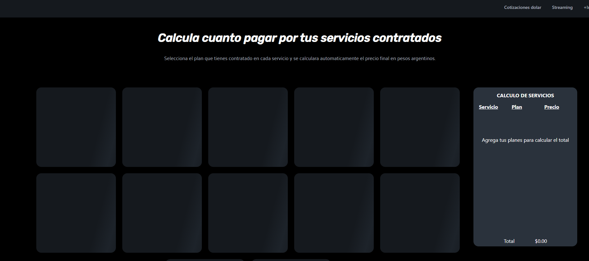
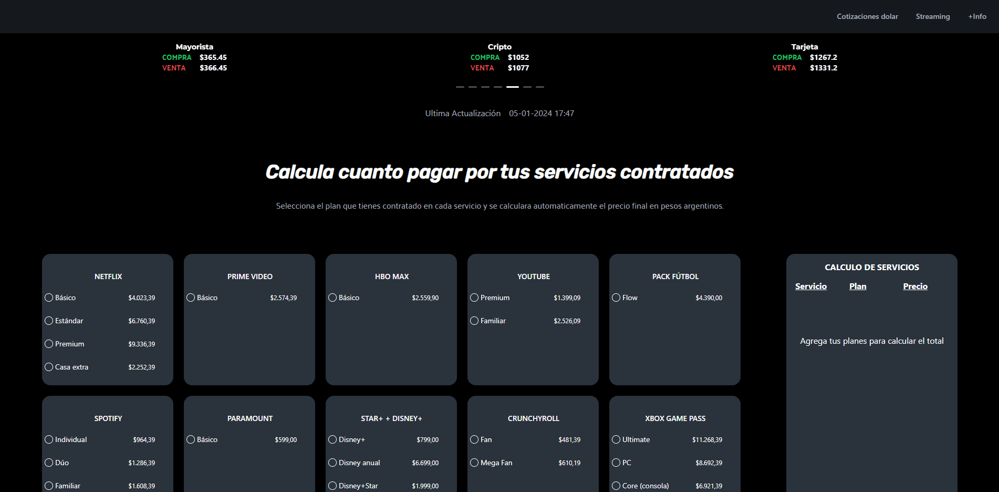
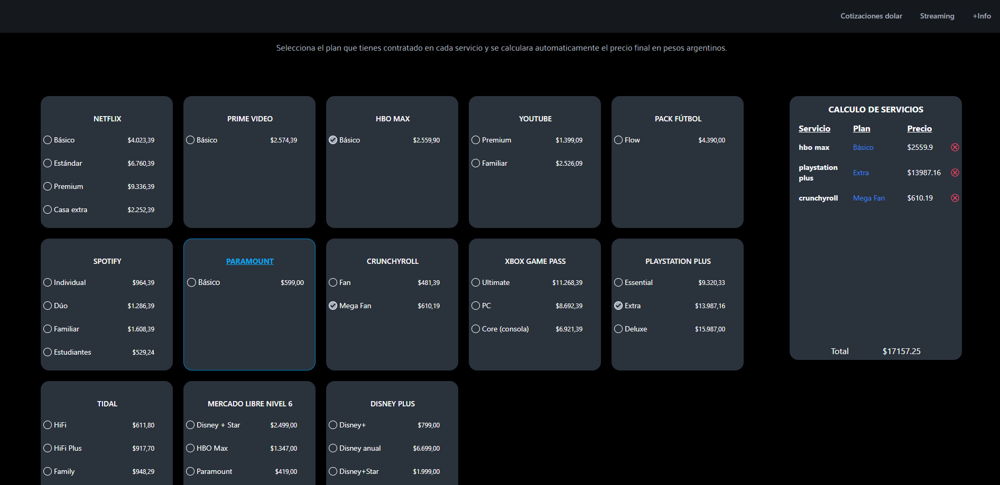
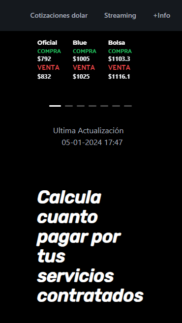
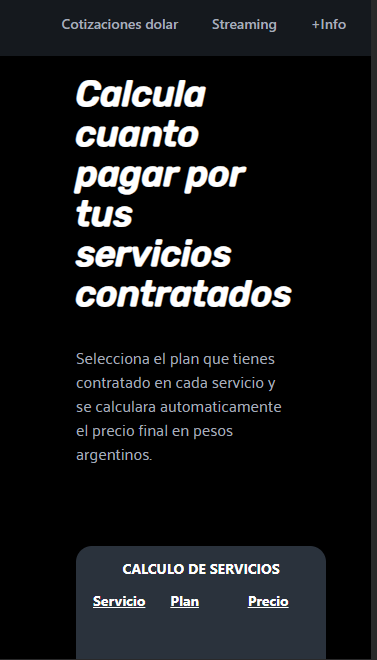
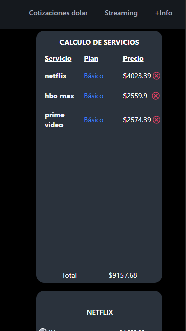

# Streaming Price App

This project lists a few streaming services that works in Argentina and the current price of the different plans that each one offer. Each plan price displays the final price after apply different taxes that the Argentinian goverment require in this kind of transactions. Also there is a carusel that show all the USD/ARG cotization that the country experiences right now, with the last actualization time. 

To get the the streaming services plans prices I use Zustand for scrapping websites. Later I use the data for show diferent cards for that prices.

To get the USD/ARG cotization I use dolarAPI.com

## Tech Stack

**Client:** React, Zustand, TailwindCSS, DaisyUI, AntDesign, Axios.

**Server:** Node, Express, Puppeteer.

## Here are some views of the application

## Some Features

- Total Price Calculator for several streaming services plans. 
- USD/ARG value.  
- Responsive design.
- Interactive user interface.
